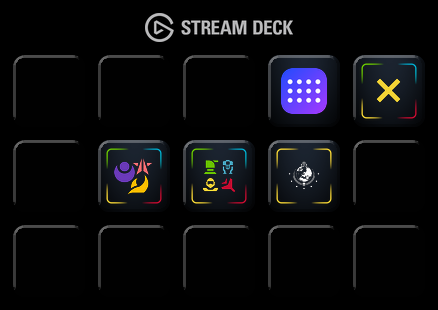
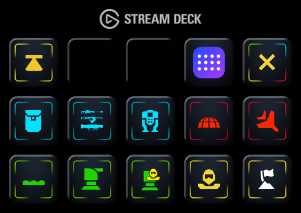
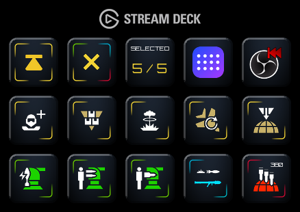
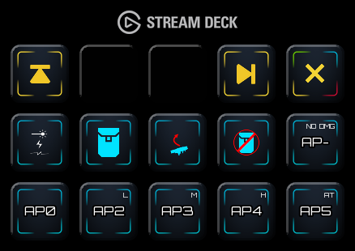
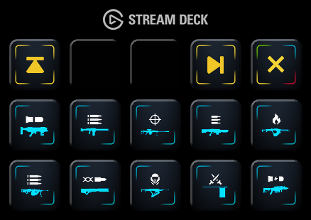
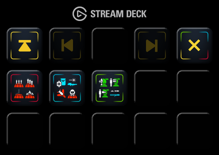
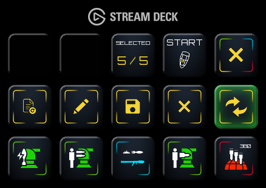
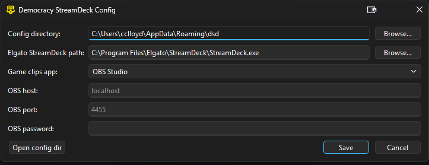
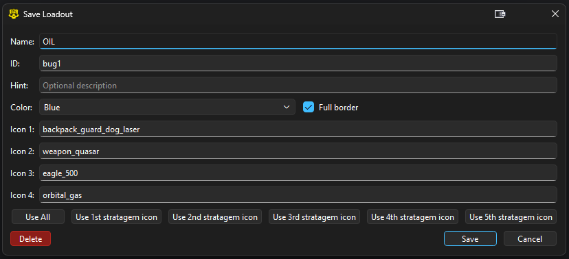

# Democracy StreamDeck

Democracy StreamDeck is an application meant to run on any Elgato StreamDeck with a 5x3 layout. It is a companion app
for Helldivers 2 to have loadout and quick drop support, allowing you to macro your stratagems to StreamDeck buttons.

# Features
- Full access to entire Helldivers 2 arsenal
- Ability to save loadouts with up to 5 stratagems
- Quick access to loadouts and ability to easily edit them.
- Includes a button for recording clips, supporting OBS or Keyboard combo
- Includes a button to quickly close and switch back to Elgato StreamDeck.
  - Pairs nicely with a multi-action key on Elgato that launches Democracy StreamDeck and closes Elgato to swap between them.

# Screenshots

<table>
  <tr>
    <td align="center">
      Home Screen 
      
    </td>
    <td align="center">
      Full Armory 
      
    </td>
    <td align="center">
      Active Loadout 
      
    </td>
  </tr>
  <tr>
    <td align="center">
      Weapon Selection 
      
    </td>
    <td align="center">
      More Weapon Selection 
      
    </td>
    <td align="center">
      Loadouts Page 
      
    </td>
  </tr>
  <tr>
    <td align="center">
      Loadout Quick Modifications 
      
    </td>
    <td align="center">
      App Config Page 
      
    </td>
    <td align="center">
      Loadout Edit Page 
      
    </td>
  </tr>
</table>

## Quickstart

Windows:

- Download the exe from the Releases page and run it. Make sure the Elgato StreamDeck app is fully closed while running
  this.
- If you don't have [`hidapi.dll`](https://github.com/libusb/hidapi/releases) installed, it will use the bundled
  version.

Linux: (Note: Linux binary only for x64 systems)

- Install `hidapi` using your package manager.
- Download `dsd` AppImage binary, mark +x and run.

### Running from source

Windows:

- Install `hidapi.dll` as above. It must be either in your `PATH`, or alongside the python executable.
- Install python and python dependencies from `requirements-soft.txt`
- From project dir, run `python -m dsdultra`

Linux:

- Install `hidapi` using your package manager.
- Install python3 and python dependencies from `requirements-soft.txt`.
- From project dir, run `python -m dsdultra`

## Development

1. Install `hidapi.dll` as above.
2. Install python packages in `requirements-soft.txt`
3. Run `python -m dsdultra`

### Building

Just run `python -m dsdultra build`. The resulting exe is located in `build/dsd.exe`.

## Resources

- [abcminiuser/python-elgato-streamdeck](https://github.com/abcminiuser/python-elgato-streamdeck?tab=readme-ov-file) for
  StreamDeck interface
- [nvigneux/Helldivers-2-Stratagems-icons-svg](https://github.com/nvigneux/Helldivers-2-Stratagems-icons-svg) for
  vanilla Helldivers Icons
